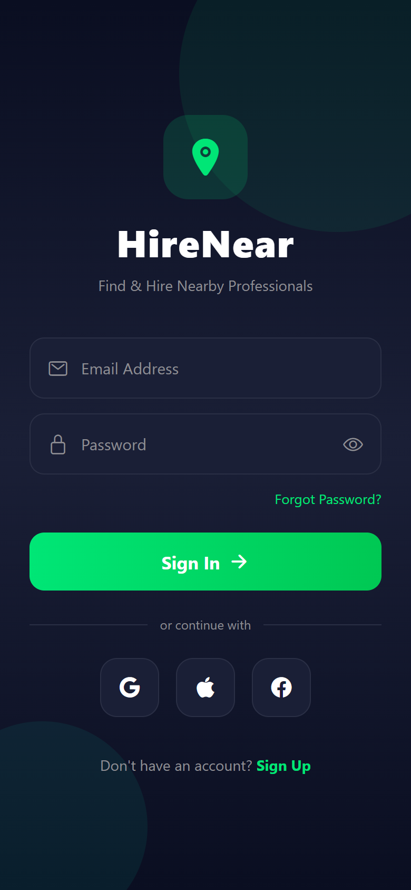
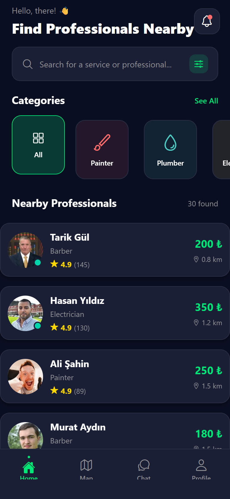
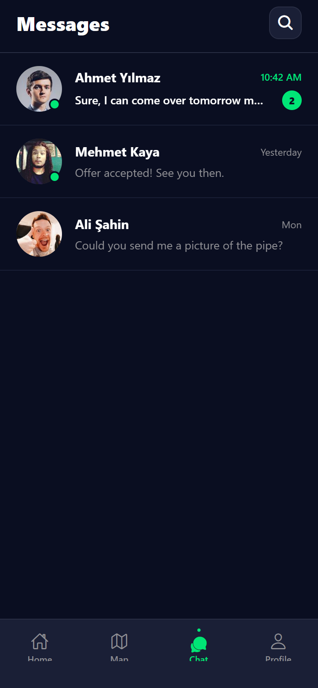
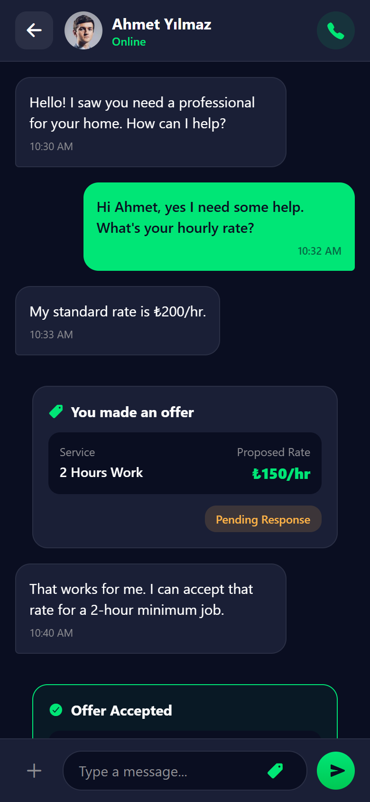

# HireNear

Hi! This is a React Native mobile application I built to explore how a local service marketplace could look and feel. The idea is simple: you need a plumber, a painter, or a gardener, and you want to find someone nearby, see their hourly rates, and book them directly through the app.

## Screenshots

<p align="center">
  
  &nbsp;&nbsp;
  
  &nbsp;&nbsp;
  
  &nbsp;&nbsp;
  
</p>

## What's inside?

I focused heavily on the UI/UX, designing a custom dark theme using some premium gradient colors to make it stand out. I used Expo to bootstrap the project because it makes iterating on the design much faster. 

Here are the main features I implemented:
- **Service Categories:** Browse different categories like IT Support, Cleaning, and Moving.
- **Local Professionals:** See a list of nearby professionals. I mocked a bunch of data with realistic Turkish names and locations around Istanbul to make it feel like a real app.
- **Detailed Profiles:** Check out a professional's profile, including their past reviews, completed jobs, and hourly rates.
- **Booking Flow:** Pick a date, time slot, and duration to book a professional. The app automatically calculates the total cost for you.
- **User Dashboard:** A personal profile screen with settings and booking history.

## Tech Stack

- **React Native & Expo:** The core mobile framework.
- **TypeScript:** To keep the code clean and avoid silly type errors.
- **React Navigation:** Handles the bottom tab bar and screen-to-screen transitions.

## How to run it locally

If you want to poke around the code or run it on your own device:

```bash
# Clone the repository
git clone https://github.com/ZanyarErkozan/HireNear-Service-Marketplace.git
cd HireNear-Service-Marketplace

# Install dependencies
npm install

# Start the Expo server
npx expo start
```
You can then scan the QR code with the Expo Go app on your phone, or run `npx expo start --web` to view it in your browser.

## Why I built this

I built this project to focus primarily on frontend UI/UX, navigation flows, and complex components (like the booking system). 

To make it as frictionless as possible for anyone checking out the repository, I designed it to run entirely locally using mock data. There's no need to spin up a database or configure environment variables just to see it in action. However, the data layer and state management are structured so that swapping out the local mocks for real REST or GraphQL API calls would be straightforward. I'm fully experienced with integrating frontends to live backend servers, but I wanted this specific portfolio piece to be instantly playable for anyone who clones it. Feel free to poke around the code!
